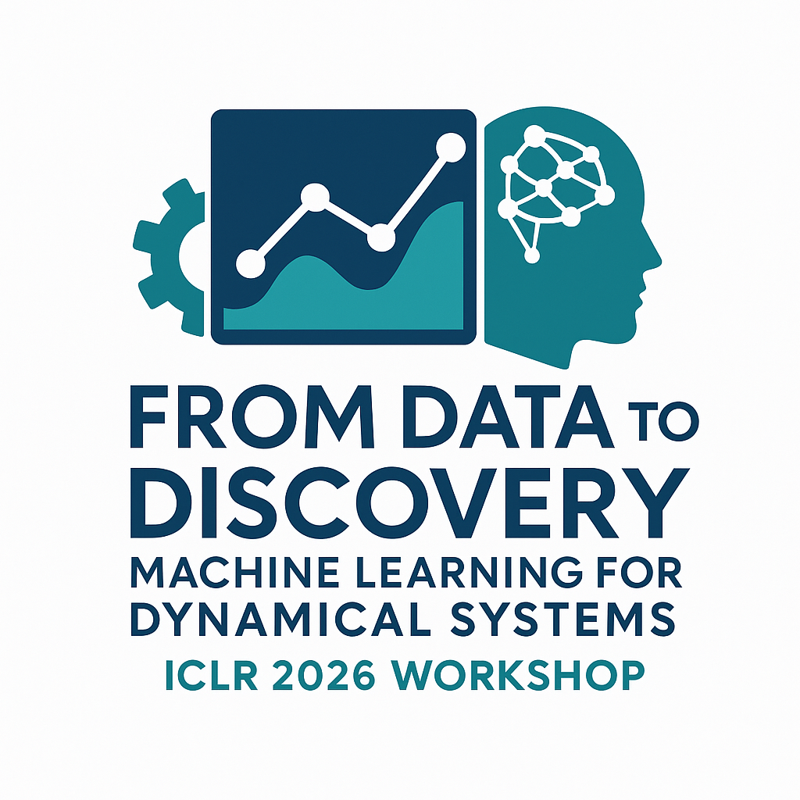

From Data to Discovery: Machine Learning for Dynamical Systems
===============================================================

*ICLR 2026 workshop proposal*

Dynamical systems provide the foundation for modeling and understanding complex scientific phenomena, from healthcare to climate science and beyond. The recent availability of large-scale time-series data has created unprecedented opportunities to study how these systems evolve and how external influences shape their behavior. Building on these datasets, machine learning has made rapid advances in modeling dynamics: foundation models for time series excel at forecasting system evolution, while AI agents equipped with world models can plan and make decisions by reasoning over possible futures. Despite these successes, a fundamental question remains: do these models truly capture the mechanisms that govern real-world systems? Mechanistic understanding is crucial for scientific insight, robust reasoning, adaptation, and reliable control. Realizing the scientific potential of these models requires rigorously assessing and advancing their ability to represent and reason about underlying mechanisms of complex scientific phenomena.

The goal of this workshop is to bring together researchers from different communities to critically examine how current machine learning methods can advance scientific understanding of complex systems. By fostering interdisciplinary dialogue, we aim to assess the strengths and limitations of large models, identify promising directions for modeling, learning, and control, and highlight opportunities for closer integration between approaches. Grounding these discussions in real scientific applications, the workshop seeks to introduce exciting open problems to the broader community and stimulate the development of new approaches to address fundamental challenges in the sciences.

Call for Papers
---------------

We invite contributions on the following topics:

1. Time series modeling & time series foundation models (including applications)
2. Dynamical systems modeling & hybrid modeling (including applications)
3. Applications such as (but not limited to) healthcare, biology, neuroscience, and climate modeling
4. Control Theory, reinforcement learning, and world models

**Submission Types**

Submissions will present novel work and reflect the diversity of perspectives that the workshop aims to foster and connect. Contributions must be original and not published at any prior conference, including ICLR 2026. We invite four complementary types of submissions:

- **Research papers** (4-6 pages): Present original work that advances methods or applications related to the workshop theme.
- **Tiny papers** (2 pages): Early-stage, concise, or exploratory ideas that would benefit from community feedback during the workshop. This track aims at lowering the barrier to participation for researchers who may not typically publish in ML venues.
- **Datasets and benchmarks** (2-4 pages): Introduce novel datasets, benchmarks, or evaluation protocols relevant to time series and dynamics benchmarking. Submission of code and/or data is mandatory for this track.

All submissions must follow the ICLR 2026 formatting guidelines (page limits exclude references and appendices) and will be reviewed through OpenReview under a double-blind process. Accepted papers will be presented in poster sessions, with a subset selected for oral presentations. Paper PDFs and poster thumbnails will be available on the workshop website. The workshop will be non-archival, and a Best Paper Award will be given to one paper, selected by the program committee.

Important Dates
---------------

Our submission timeline follows the ICLR 2026 recommended schedule:

- **15 December 2025:** Submission portal opens
- **30 January 2026:** Submission deadline
- **15 February 2026:** Reviewing deadline
- **1 March 2026:** Author notification (global deadline)
- **19 April 2026:** Camera-ready deadline and poster upload

Tentative Invited Speakers & Panelists
-----------------------------

We have invited a diverse set of speakers for invited talks and researchers for a panel discussion. All speakers and panelists have confirmed their interest in participating in the workshop.

.. raw:: html
    :file: speakers.html

Organizers
----------

.. raw:: html
    :file: organizers.html

Program Committee
-----------------

TBC

.. Contact
.. -------
.. Please reach the workshop organizers at ``fdd-iclr26@googlegroups.com``.

.. toctree::
   :maxdepth: 2
   :hidden:

   Home <self>
   Schedule <schedule>
   Papers <papers>

.. meta::
      :title: From Data to Discovery: Machine Learning for Dynamical Systems

      :description lang=en:
         Workshop at ICLR 2026 bringing together researchers to critically examine how current machine learning methods can advance scientific understanding of complex systems.
