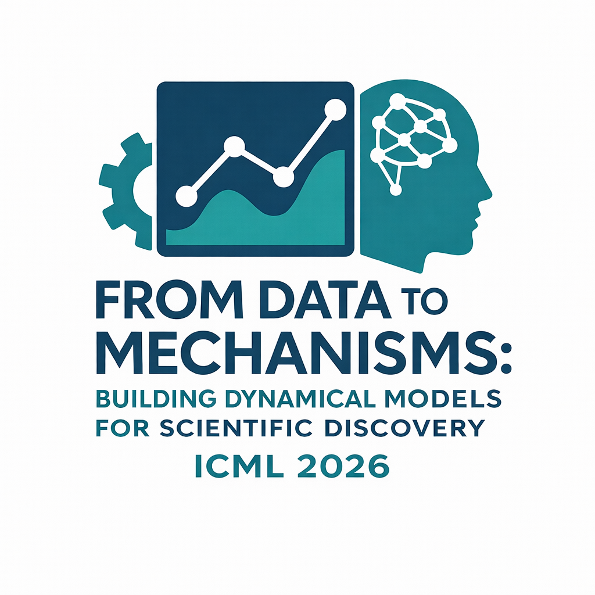

From Data to Mechanisms: Building Dynamical Models for Scientific Discovery
===============================================================

*ICML 2026 workshop proposal*

.. container:: centered-intro

 This workshop focuses on data-driven dynamical models for scientific discovery and on bridging the gap between performance and mechanistic validity. Three questions shape the program: (1) *What level of mechanistic understanding in dynamical models is needed for different scientific domains and questions?*; (2) *When can purely data-driven models reliably surface scientific insights about the underlying observed system, and how can we evaluate this?*; (3) *How can we improve mechanistic validity through inductive biases and hybrid designs?* We invite contributions on topics including, but not limited to, the following: Time-series and dynamical systems modeling, hybrid approaches that combine mechanistic and data-driven methods, control theory, reinforcement learning, and applications of these methods to domains such as healthcare, biology, and climate science.
Call for Papers
---------------

We invite contributions on the following topics:

1. Time series modeling & time series foundation models (including applications)
2. Dynamical systems modeling & hybrid modeling (including applications)
3. Applications such as (but not limited to) healthcare, biology, neuroscience, and climate modeling
4. Control Theory, reinforcement learning, and world models

**Submission Types**

Submissions will present novel work and reflect the diversity of perspectives that the workshop aims to foster and connect. Contributions must be original and not published at any prior conference, including ICML 2026. We invite two complementary types of submissions:

- **Research papers** (4-6 pages): Present original work that advances methods or applications related to the workshop theme.
- **Datasets and benchmarks** (2-4 pages): Introduce novel datasets, benchmarks, or evaluation protocols relevant to time series and dynamics benchmarking. Submission of code and/or data is mandatory for this track.

All submissions must follow the ICML 2026 formatting guidelines (page limits exclude references and appendices) and will be reviewed through OpenReview under a double-blind process. Accepted papers will be presented in poster sessions, with a subset selected for oral presentations. Paper PDFs and poster thumbnails will be available on the workshop website. The workshop will be non-archival, and a Best Paper Award will be given to one paper, selected by the program committee.

Important Dates
---------------

Our submission timeline follows the ICML 2026 recommended schedule:

- **10 April 2026:** Submission portal opens
- **24 April 2026:** Submission deadline
- **5 May 2026:** Reviewing deadline
- **15 May 2026:** Author notification (global deadline)
- **15 June 2026:** Camera-ready deadline and poster upload

Tentative Invited Speakers & Panelists
-----------------------------

We have invited a diverse set of speakers for invited talks and researchers for a panel discussion. All speakers and panelists have confirmed their interest in participating in the workshop.

.. raw:: html
    :file: speakers.html

Organizers
----------

.. raw:: html
    :file: organizers.html

Program Committee
-----------------

TBC

.. Contact
.. -------
.. Please reach the workshop organizers at ``fdtm-icml26@googlegroups.com``.

.. toctree::
   :maxdepth: 2
   :hidden:

   Home <self>
   Schedule <schedule>
   Papers <papers>

.. meta::
      :title: From Data to Discovery: Machine Learning for Dynamical Systems

      :description lang=en:
         Workshop at ICML 2026 bringing together researchers to critically examine how current machine learning methods can advance scientific understanding of complex systems.
